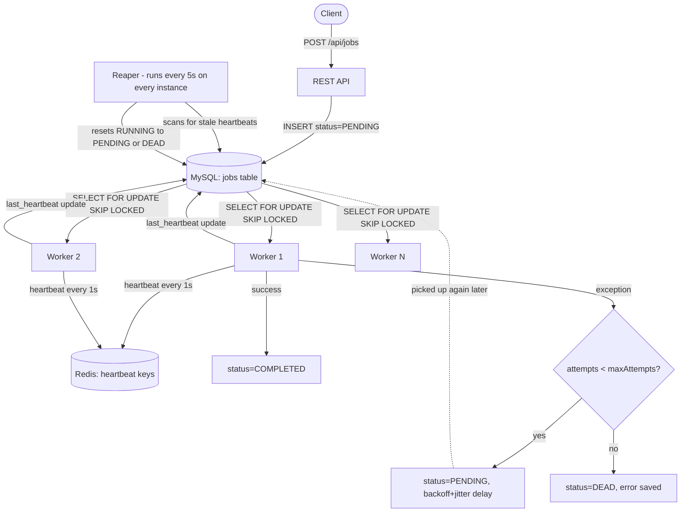

Readme · MD
# Distributed Fault-Tolerant Job Scheduler

A multi-worker background job orchestration system built in Java/Spring Boot, designed to safely run scheduled and one-off tasks across multiple independent server instances — without duplicate execution, and with automatic recovery from worker crashes.

## Why this project exists

A naive scheduled-task setup (e.g., Spring's `@Scheduled` alone) breaks the moment you run more than one instance of your application: every instance runs the same job at the same time, causing duplicate charges, duplicate emails, or corrupted data. This project solves that coordination problem properly, using database-level locking and a self-healing failure-recovery layer — the same class of problem real distributed job queues (Sidekiq, Celery, Quartz, Temporal) exist to solve.

## Tech stack

| Technology | Purpose |
|---|---|
| Java 21 / Spring Boot | Application runtime, REST API, dependency injection |
| MySQL 8.0 | Source of truth for job state; `SELECT ... FOR UPDATE SKIP LOCKED` for atomic claiming |
| Redis | Lightweight worker liveness signaling (heartbeats with TTL) |
| Docker & Docker Compose | Multi-container cluster simulating independent servers |
| Micrometer / Spring Actuator | Runtime metrics (throughput, failures, active workers) |

## Architecture

A client submits a job over the REST API, which is written to MySQL with status `PENDING`. Every worker instance — each running in its own independent container — polls the database on a fixed interval and attempts to atomically claim the next eligible job using `SELECT ... FOR UPDATE SKIP LOCKED`. Because this claim happens inside a single database transaction, MySQL itself guarantees that when several workers poll at the same moment, exactly one of them succeeds in claiming any given job; the others either skip it and grab a different one, or find nothing available.



Once a worker claims a job, it moves the job to `RUNNING` and begins processing. While the task executes, the worker sends a heartbeat — both a short-lived key in Redis and a timestamp column in MySQL — roughly once per second, signaling "I am still alive and working on this." A separate, independent process called the Reaper runs on every instance every five seconds and scans for jobs stuck in `RUNNING` whose heartbeat has gone stale. If it finds one, it assumes the worker that claimed it has crashed or been killed, and resets the job back to `PENDING` so a healthy worker can pick it up — or moves it to `DEAD` if it has already exhausted its retry attempts.

If a job's task logic throws an exception, the worker catches it, calculates a retry delay using exponential backoff with random jitter, and pushes the job back to `PENDING` with a future scheduled time. Once a job has failed enough times to exhaust its configured `maxAttempts`, it is moved permanently to `DEAD` status with the underlying error message preserved — a Dead Letter Queue a human can later inspect.

### Job lifecycle

```
PENDING → RUNNING → COMPLETED
              |
              |-- (failure) --> PENDING (after backoff delay) --> ... --> DEAD
              |
              `-- (crash, heartbeat goes stale) --> reclaimed by Reaper --> PENDING
```

## Core mechanisms

### 1. Atomic, concurrency-safe job claiming

Workers claim jobs using `SELECT ... FOR UPDATE SKIP LOCKED` inside a transaction:

```sql
SELECT id FROM jobs
WHERE status = 'PENDING' AND scheduled_at <= :now
ORDER BY priority DESC, scheduled_at ASC
LIMIT 1
FOR UPDATE SKIP LOCKED
```

When multiple workers query simultaneously, MySQL guarantees each one gets a different row (or none) — no waiting, no duplicate claims. Verified with a JUnit test that fires 10 concurrent threads at the same job and asserts exactly one succeeds.

### 2. Heartbeat-based liveness

While processing, each worker refreshes a Redis key (`worker:heartbeat:<workerId>`, 6s TTL) and a `last_heartbeat` timestamp in MySQL. A separate continuous "presence" heartbeat, independent of task execution, keeps the worker visible in cluster-wide metrics even when idle.

### 3. The Reaper — crash recovery

Every 5 seconds, on every instance, a scheduled job resets any `RUNNING` job whose heartbeat has gone stale back to `PENDING` (or `DEAD`, if retries are exhausted). A crashed or killed worker's in-flight job is automatically picked up by a healthy worker — verified by manually killing a worker mid-task and observing recovery in the logs.

### 4. Retry with exponential backoff and jitter

Failed jobs retry with increasing delay (5s, 10s, 20s...) plus a few seconds of random jitter, preventing a "thundering herd" where many failed jobs retry simultaneously against a struggling downstream service. After exhausting `maxAttempts`, jobs move to `DEAD` with the error message preserved.

### 5. Ownership-safe completion

Completion and failure updates are guarded by `WHERE locked_by = :workerId AND status = 'RUNNING'`, so a worker can only finalize a job it currently owns. This closes a real race condition between a slow worker and the Reaper (see below).

## A real bug found and fixed during development

While testing in a genuine multi-container Docker cluster — not just simulated with local threads — a worker that was slow to send its first heartbeat, due to JVM startup time inside the container, had its job falsely reclaimed by the Reaper on another container. The result: both workers ended up completing the same job.

**Root cause:** the original completion logic trusted a worker's local, in-memory belief that it still owned the job, with no check against the database's current state before writing `COMPLETED`.

**Fix:** completion and failure queries now require `locked_by = :workerId AND status = 'RUNNING'` as part of the atomic `UPDATE`, and the code checks how many rows were actually affected. If ownership had shifted away in the meantime, the worker logs that it lost ownership and backs off instead of overwriting another worker's result. This is a form of *fencing* — a standard technique in distributed systems for preventing a stale actor from corrupting state after it has lost ownership of a resource.

## Running locally

```bash
docker compose up --build
```

This starts MySQL, Redis, and two independent worker containers (ports 8080 and 8081), sharing the same database — a real multi-server cluster running on one machine.

### Submit a job

```bash
POST http://localhost:8080/api/jobs
Content-Type: application/json
 
{
  "idempotencyKey": "example-001",
  "taskType": "SEND_EMAIL",
  "payload": "{\"to\": \"user@example.com\"}",
  "priority": 1,
  "maxAttempts": 3,
  "scheduledAt": "2026-01-01T00:00:00"
}
```

Submitting the same `idempotencyKey` a second time returns the original job instead of creating a duplicate.

### Check metrics

```bash
GET http://localhost:8080/actuator/metrics/jobs.completed.total
GET http://localhost:8080/actuator/metrics/jobs.failed.total
GET http://localhost:8080/actuator/metrics/jobs.dead.total
GET http://localhost:8080/actuator/metrics/workers.active
```

## Testing

Run the concurrency test, which proves zero duplicate job claims under 10 simultaneous threads racing for the same job:

```bash
mvn test -Dtest=JobWorkerConcurrencyTest
```

## What I'd add with more time

- Testcontainers-based integration tests, so the test suite spins up disposable MySQL/Redis instances instead of relying on a running local environment
- A load-testing harness that injects thousands of concurrent job submissions to measure real throughput and confirm zero duplicates at scale
- Prometheus and Grafana dashboards built on top of the existing Micrometer metrics
- Externalized secrets — database credentials currently live in `docker-compose.yml` for local development simplicity, and would move to environment-specific secret management in a real deployment
 
